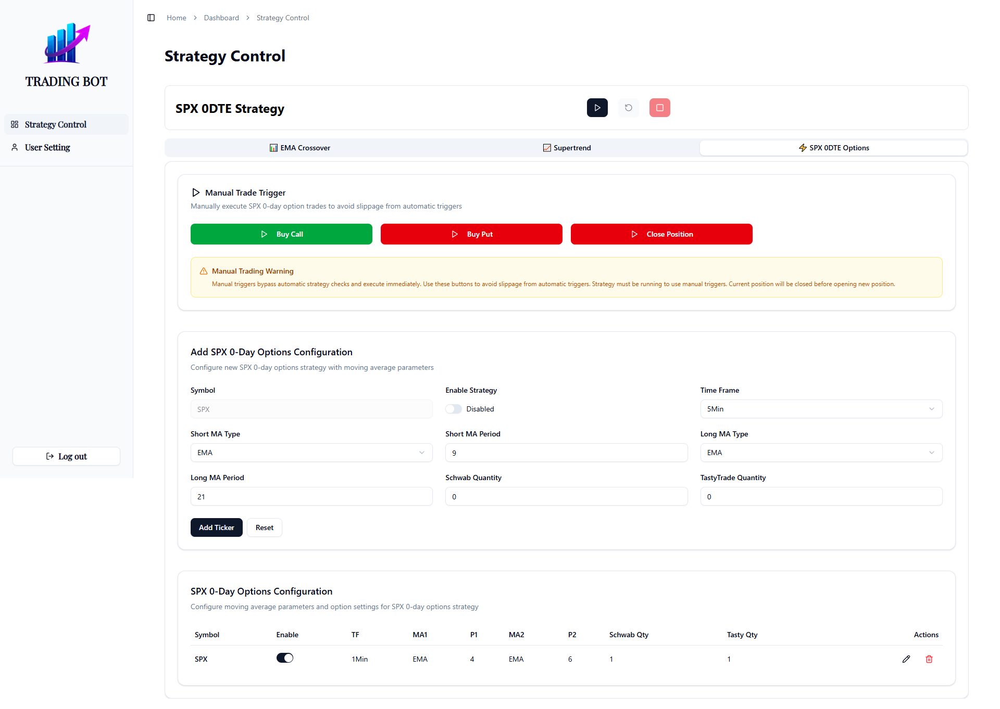

# Tasty Trading Bot - Frontend Dashboard

A sophisticated web-based trading control panel built with Next.js, providing real-time monitoring and control capabilities for automated trading strategies. This frontend application serves as the primary interface for traders to manage their automated trading operations with professional-grade tools and intuitive user experience.

## 📸 Screenshots


*Secure login interface with modern design*


*EMA Crossover strategy configuration interface*


*SPX 0DTE options trading configuration*


*User settings and account management interface*

## 🎯 Key Features

### 📊 **Real-Time Dashboard**
- Live monitoring of all active trading strategies
- Real-time position tracking and P&L updates
- Comprehensive trade history and performance metrics
- Interactive charts and visualizations

### ⚙️ **Strategy Management**
- **EMA Crossover Strategy**: Configure exponential moving average parameters
- **Supertrend Strategy**: Set up trend-following indicators and thresholds
- **SPX 0DTE Options**: Zero-day expiration options trading with manual triggers
- Dynamic parameter adjustment and real-time strategy switching

### 🎮 **Manual Trading Controls**
- One-click trade execution for SPX 0DTE strategies
- Emergency stop and reversal capabilities
- Real-time position management
- Risk management controls

### 🔐 **Security & Authentication**
- JWT-based secure authentication system
- Role-based access control (Admin/Trader roles)
- Session management and token validation
- Secure API communication

### 🎨 **Modern User Interface**
- Responsive design optimized for desktop and mobile
- Dark/light theme support
- Intuitive navigation with sidebar layout
- Professional trading-focused design

## 🏗️ Architecture Overview

```
┌─────────────────┐    ┌─────────────────┐    ┌─────────────────┐
│   Frontend      │    │   Backend API   │    │  Trading Engine │
│   (Next.js)     │◄──►│   (FastAPI)     │◄──►│   (Python)      │
│                 │    │                 │    │                 │
│ • Dashboard     │    │ • Authentication│    │ • Strategy      │
│ • Strategy UI   │    │ • Data API      │    │   Execution     │
│ • User Mgmt     │    │ • WebSocket     │    │ • Risk Mgmt     │
└─────────────────┘    └─────────────────┘    └─────────────────┘
```

## 🖥️ Technology Stack

### **Frontend**
- **Framework**: Next.js 15.4.3 with App Router
- **UI Library**: Radix UI primitives with shadcn/ui components
- **Styling**: Tailwind CSS 4.0 with custom design system
- **State Management**: React Context API
- **Authentication**: JWT token-based authentication
- **Icons**: Lucide React icon library

### **Backend Integration**
- **API**: Python FastAPI backend
- **Real-time**: WebSocket connections for live data
- **Authentication**: JWT-based secure communication
- **Deployment**: AWS infrastructure

### **Development Tools**
- **Language**: TypeScript for type safety
- **Linting**: ESLint with Next.js configuration
- **Build**: Next.js optimized production builds

## 🚀 Quick Start

### Prerequisites
- Node.js 18.0 or later
- npm or yarn package manager
- Access to the trading backend API

### Installation

1. **Clone the repository**
   ```bash
   git clone https://github.com/0x0Zeus/tasty-schwab-trader-FE.git
   cd tasty-schwab-trader-FE
   ```

2. **Install dependencies**
   ```bash
   npm install
   # or
   yarn install
   ```

3. **Environment Configuration**
   Create a `.env.local` file in the root directory:
   ```bash
   # Backend API Configuration
   NEXT_PUBLIC_API_URL=http://localhost:8000
   NEXT_PUBLIC_WS_URL=ws://localhost:8000/ws
   
   # Optional: Development settings
   NODE_ENV=development
   ```

4. **Start development server**
   ```bash
   npm run dev
   # or
   yarn dev
   ```

5. **Access the application**
   Open [http://localhost:3000](http://localhost:3000) in your browser

## 📦 Production Deployment

### Build for Production
```bash
npm run build
npm run start
```

### Deployment Options

#### **Vercel (Recommended)**
1. Connect your GitHub repository to Vercel
2. Configure environment variables in Vercel dashboard
3. Deploy automatically on push to main branch

#### **AWS Amplify**
1. Connect repository to AWS Amplify
2. Configure build settings:
   ```yaml
   version: 1
   frontend:
     phases:
       preBuild:
         commands:
           - npm install
       build:
         commands:
           - npm run build
     artifacts:
       baseDirectory: .next
       files:
         - '**/*'
   ```

#### **Docker Deployment**
```dockerfile
FROM node:18-alpine
WORKDIR /app
COPY package*.json ./
RUN npm ci --only=production
COPY . .
RUN npm run build
EXPOSE 3000
CMD ["npm", "start"]
```

## 🔧 Development

### Available Scripts
- `npm run dev` - Start development server with Turbopack
- `npm run build` - Build production application
- `npm run start` - Start production server
- `npm run lint` - Run ESLint for code quality

### Project Structure
```
src/
├── app/                    # Next.js App Router pages
│   ├── dashboard/          # Main dashboard pages
│   ├── login/              # Authentication pages
│   └── layout.tsx          # Root layout
├── components/             # Reusable UI components
│   ├── ui/                 # shadcn/ui components
│   ├── strategy-control/   # Trading strategy components
│   └── user-setting/      # User management components
├── context/                # React Context providers
├── hooks/                  # Custom React hooks
└── lib/                    # Utility functions and types
```

## 🤝 Contributing

We welcome contributions to improve the trading dashboard! Please follow these guidelines:

### Development Workflow
1. Fork the repository
2. Create a feature branch: `git checkout -b feature/amazing-feature`
3. Make your changes and test thoroughly
4. Commit your changes: `git commit -m 'Add amazing feature'`
5. Push to the branch: `git push origin feature/amazing-feature`
6. Open a Pull Request

### Code Standards
- Follow TypeScript best practices
- Use ESLint configuration provided
- Write meaningful commit messages
- Add tests for new features
- Update documentation as needed

### Reporting Issues
- Use GitHub Issues for bug reports
- Provide detailed reproduction steps
- Include browser/OS information
- Attach screenshots if applicable

## 📋 Roadmap

### Upcoming Features
- [ ] **Advanced Analytics Dashboard**
  - Real-time performance charts
  - Historical trade analysis
  - Risk metrics visualization

- [ ] **Enhanced Notifications**
  - Email alerts for trade events
  - Telegram integration
  - Push notifications

- [ ] **Mobile Optimization**
  - Progressive Web App (PWA) support
  - Mobile-first responsive design
  - Touch-optimized controls

- [ ] **Advanced Strategy Features**
  - Custom strategy builder
  - Backtesting capabilities
  - Paper trading mode

- [ ] **User Experience Improvements**
  - Dark/light theme toggle
  - Customizable dashboard layouts
  - Keyboard shortcuts

## 📄 License

This project is licensed under the MIT License - see the [LICENSE](LICENSE) file for details.

## 🔒 Security

For security concerns or to report vulnerabilities, please contact the development team directly rather than opening a public issue.

## 📞 Support

- **Documentation**: Check this README and inline code comments
- **Issues**: Use GitHub Issues for bug reports and feature requests
- **Discussions**: Use GitHub Discussions for questions and community support

---

**Built with ❤️ for professional traders**